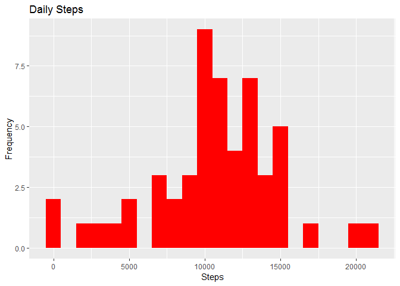
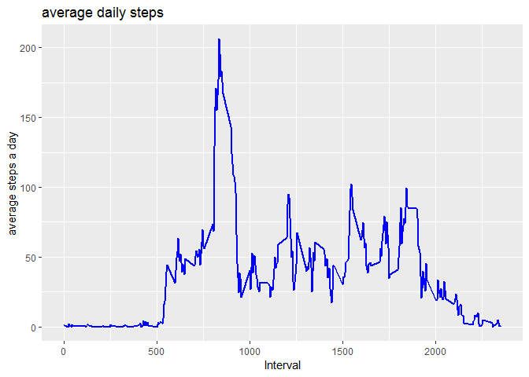
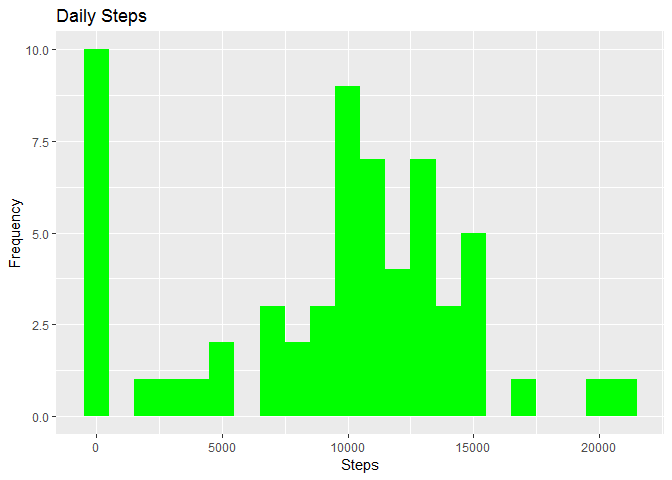
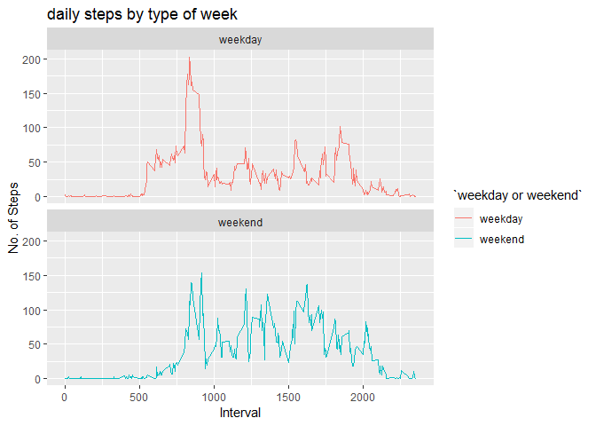

## Introduction

This assignment makes use of data from a personal activity monitoring device. This device collects data at 5 minute intervals through out the day. The data consists of two months of data from an anonymous individual collected during the months of October and November, 2012 and include the number of steps taken in 5 minute intervals each day.


The variables included in this dataset are:

steps: Number of steps taking in a 5-minute interval (missing values are coded as NA) 
date: The date on which the measurement was taken in YYYY-MM-DD format 
interval: Identifier for the 5-minute interval in which measurement was taken 

The dataset is stored in a comma-separated-value (CSV) file and there are a total of 17,568 observations in this dataset. 

## Loading and preprocessing the data
download the file, unzip it and keep in same directory as your code script.
Load the necessary libraries, I've used ggplot2


```r
library("data.table")
library(ggplot2)
```

Reading csv Data using Data.Table library. 

```r
activity_data <- fread(input = "activity.csv")
```

## What is mean total number of steps taken per day?

Calculate the number of steps taken per day and display first 5 values


```r
steps <- activity_data[, c(lapply(.SD, sum, na.rm = FALSE)), .SDcols = c("steps"), by = .(date)] 

head(steps, 5)
```

```
##          date steps
## 1: 2012-10-01    NA
## 2: 2012-10-02   126
## 3: 2012-10-03 11352
## 4: 2012-10-04 12116
## 5: 2012-10-05 13294
```

Histogram of the total number of steps taken each day. I have chosen red for the plot  


```r
ggplot(steps, aes(x = steps)) + geom_histogram(fill = "red", binwidth = 1000) + labs(title = "Daily Steps", x = "Steps", y = "Frequency")
```

```
## Warning: Removed 8 rows containing non-finite values (stat_bin).
```

<!-- -->

Mean and median of the total number of steps taken per day  
  

```r
steps[, .(Mean_Steps = mean(steps, na.rm = TRUE), Median_Steps = median(steps, na.rm = TRUE))]
```

```
##    Mean_Steps Median_Steps
## 1:   10766.19        10765
```

## What is the average daily activity pattern?

Time series plot of the 5-minute interval (x-axis) and the average number of steps taken, averaged across all days (y-axis)


```r
intervals <- activity_data[, c(lapply(.SD, mean, na.rm = TRUE)), .SDcols = c("steps"), by = .(interval)] 

ggplot(intervals, aes(x = interval , y = steps)) + geom_line(color="blue", size=1) + labs(title = "average daily steps", x = "Interval", y = "average steps a day")
```

<!-- -->

the 5-minute interval, on average across all the days in the dataset, that contains the maximum number of steps


```r
intervals[steps == max(steps), .(max_interval = interval)]
```

```
##    max_interval
## 1:          835
```


## Imputing missing values

Calculate and the total number of NA's


```r
activity_data[is.na(steps), .N ]
```

```
## [1] 2304
```

I fill in the missing values with median of dataset 


```r
# fill in the missing values with median of dataset 
activity_data[is.na(steps), "steps"] <- activity_data[, c(lapply(.SD, median, na.rm = TRUE)), .SDcols = c("steps")]
```


create a new csv file without the missing values


```r
fwrite(x = activity_data, file = "newdata.csv", quote = FALSE)
```

A histogram of the total number of steps taken each day along with the mean and median total number of steps taken per day. These values differ from the estimates from the first part of the assignment. Inputing missing data leads to a decrease in the mean as well as the median.


```r
# total steps taken a day
steps <- activity_data[, c(lapply(.SD, sum)), .SDcols = c("steps"), by = .(date)] 
# mean and median total number of steps taken a day
steps[, .(Mean_Steps = mean(steps), Median_Steps = median(steps))]
```

```
##    Mean_Steps Median_Steps
## 1:    9354.23        10395
```

```r
ggplot(steps, aes(x = steps)) + geom_histogram(fill = "green", binwidth = 1000) + labs(title = "Daily Steps", x = "Steps", y = "Frequency")
```

<!-- -->

 Mean_Steps and  Median_Steps

With NA's removed  10765 and 10765  
With NA's remaining  9354.23 and 10395

## Are there differences in activity patterns between weekdays and weekends?

factor variable in the dataset with two levels weekday and weekend indicating whether a given date is a weekday or weekend day.


```r
activity_data[, date := as.POSIXct(date, format = "%Y-%m-%d")]
activity_data[, `Day of Week`:= weekdays(x = date)]
activity_data[grepl(pattern = "Monday|Tuesday|Wednesday|Thursday|Friday", x = `Day of Week`), "weekday or weekend"] <- "weekday"
activity_data[grepl(pattern = "Saturday|Sunday", x = `Day of Week`), "weekday or weekend"] <- "weekend"
activity_data[, `weekday or weekend` := as.factor(`weekday or weekend`)]
head(activity_data, 5)
```

```
##    steps       date interval Day of Week weekday or weekend
## 1:     0 2012-10-01        0      Monday            weekday
## 2:     0 2012-10-01        5      Monday            weekday
## 3:     0 2012-10-01       10      Monday            weekday
## 4:     0 2012-10-01       15      Monday            weekday
## 5:     0 2012-10-01       20      Monday            weekday
```

A panel plot of the 5-minute interval (x-axis) and the average number of steps taken, averaged across all weekday days or weekend days (y-axis)


```r
activity_data[is.na(steps), "steps"] <- activity_data[, c(lapply(.SD, median, na.rm = TRUE)), .SDcols = c("steps")]
Intervals <- activity_data[, c(lapply(.SD, mean, na.rm = TRUE)), .SDcols = c("steps"), by = .(interval, `weekday or weekend`)] 
ggplot(Intervals , aes(x = interval , y = steps, color=`weekday or weekend`)) + geom_line() + labs(title = "daily steps by type of week", x = "Interval", y = "No. of Steps") + facet_wrap(~`weekday or weekend` , ncol = 1, nrow=2)
```

<!-- -->
